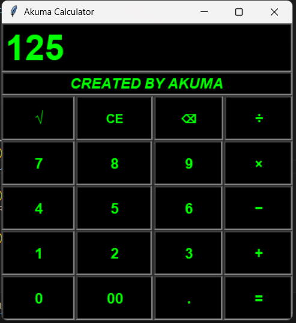

# 🖩 Akuma Calculator

This is a **basic calculator GUI** I built years ago using Python’s `tkinter` library.  
It features a custom design, manual button placement, and basic error handling.  

⚠️ **Note:**  
This is an **old project** uploaded just for **fun and learning**. It’s not optimized or production-ready.

---

## ✨ Features
- Standard calculator operations (+, −, ×, ÷)
- Square root function
- Clear entry (`CE`) and backspace (`⌫`) buttons
- Error handling for invalid input and division by zero
- Custom styling (green text on black background)

---

## 🛠️ Technologies
- Python 3.x
- [tkinter](https://docs.python.org/3/library/tkinter.html) (built-in)

---

## 📂 How to Run
### 1️⃣ Clone the repo:
   ```bash
   git clone https://github.com/Arsalan692/Turtle-Google-Logo
   ```
### 2️⃣ Run the script:
   ```bash
   python google_logo.py
   ```

---
## 📸 Demo Screenshot
<p align="center">
  
</p>
